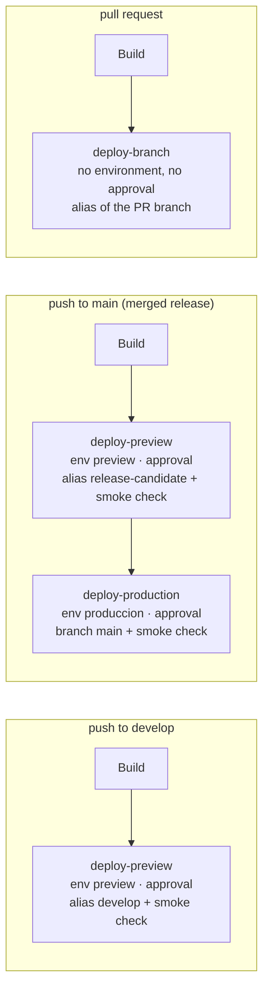

# Deploy: Cloudflare Pages, R2 and GitHub Actions

The landing and the Flutter PWA are **two Cloudflare Pages projects**, each on its own custom domain:

| Pages project      | Custom domain                     | Content                                 | Deployed by                                                                             |
| ------------------ | --------------------------------- | --------------------------------------- | --------------------------------------------------------------------------------------- |
| `te-tengo-landing` | `https://tetengo.reqsai.tech`     | This Astro site                         | `deploy.yml` (push to `develop` and `main`, PR previews) and manual `publicar.yml` runs |
| `te-tengo-app`     | `https://app.tetengo.reqsai.tech` | The Flutter PWA, at the root path (`/`) | `publicar.yml` only (built from `te-tengo-mobile-flutter`)                              |

The older `te-tengo` project is Git-connected to the thesis repository and serves the prototypes; these workflows never touch it.

The PWA used to live under `/app/` of the landing. Old links keep working: `public/_redirects` sends `/app`, `/app/` and `/app/*` to `https://app.tetengo.reqsai.tech/:splat` with a `301`. Cloudflare Pages accepts an absolute URL with a splat as a redirect target (the [redirects docs](https://developers.cloudflare.com/pages/configuration/redirects/) show `/blog/* https://blog.my.domain/:splat`), and redirects run before static assets. The browser keeps the `#fragment` across the redirect, so e-mailed hash links such as `/app/#/nueva-contrasena?token=…` still open the right screen.

The binaries are too large for Pages (25 MiB per file; the Windows installer is about 105 MB), so they live in a **Cloudflare R2 bucket** with public read access, under stable keys:

| Key in R2                                                         | What                                   |
| ----------------------------------------------------------------- | -------------------------------------- |
| `te-tengo.apk`, `te-tengo.apk.sha256`                             | Android universal APK                  |
| `te-tengo-captura-setup.exe`, `te-tengo-captura-setup.exe.sha256` | Te Tengo Captura installer for Windows |

Since the PWA has its own project, a landing deployment no longer has to ship it, and the PWA is no longer packed into R2 (`te-tengo-web.tar.gz`). An old copy of that object in the bucket is unused and can be deleted by hand.

## Workflows

| Workflow       | Trigger                                                                                                      | Approval on `produccion`                                                                         | Needs                                                                                                                                                         |
| -------------- | ------------------------------------------------------------------------------------------------------------ | ------------------------------------------------------------------------------------------------ | ------------------------------------------------------------------------------------------------------------------------------------------------------------- |
| `ci.yml`       | push to `main`/`develop`, PRs                                                                                | no                                                                                               | nothing                                                                                                                                                       |
| `deploy.yml`   | push to `develop` (preview) and `main` (preview, then production), PRs (previews)                            | production job; the `develop`/`main` preview stage waits on `preview`; PR previews deploy freely | `CLOUDFLARE_API_TOKEN`, `CLOUDFLARE_ACCOUNT_ID`; variables `ENABLE_LANDING_PREVIEW`, `ENABLE_LANDING_PRODUCCION`, `DESCARGAS_BASE_URL`, `SITE_URL` (optional) |
| `publicar.yml` | `repository_dispatch` `publicar-movil` / `publicar-escritorio` from the app repositories; manual from `main` | every R2 upload and Pages deployment                                                             | everything below, and the switches `ENABLE_APK`, `ENABLE_WINDOWS_INSTALLER`, `ENABLE_PWA` (`ENABLE_LANDING_PRODUCCION` on manual full runs)                   |

Every step whose secret or variable is missing prints a `::notice` with what to set and is skipped, so the workflows stay green before the setup is done.

### Switches

Each deploy channel has an on/off switch: an **organization-level Actions variable** (_Organization settings → Secrets and variables → Actions → Variables_), visible to this repository. A repository variable with the same name overrides it. Only the exact value `true` turns a channel on; an unset variable or any other value turns it off, and the run shows the job as **skipped** (with a `::notice`, and a line in the run summary). A switched-off channel never asks for an approval. The builds still run, so the run keeps checking that a release builds and keeps its artifacts.

| Variable                    | Workflow and job(s)                                                          | What it publishes                                                                 |
| --------------------------- | ---------------------------------------------------------------------------- | --------------------------------------------------------------------------------- |
| `ENABLE_LANDING_PREVIEW`    | `deploy.yml` → `deploy-preview` (develop and main), `deploy-branch` (PRs)    | The `develop`, `release-candidate` and pull request aliases of `te-tengo-landing` |
| `ENABLE_LANDING_PRODUCCION` | `deploy.yml` → `deploy-production`; `publicar.yml` → `landing` (manual runs) | `https://tetengo.reqsai.tech`                                                     |
| `ENABLE_PWA`                | `publicar.yml` → `app`                                                       | The PWA → `te-tengo-app` (`https://app.tetengo.reqsai.tech`)                      |
| `ENABLE_APK`                | `publicar.yml` → `descargas-apk`                                             | `te-tengo.apk` and its `.sha256` in R2                                            |
| `ENABLE_WINDOWS_INSTALLER`  | `publicar.yml` → `descargas-windows`                                         | `te-tengo-captura-setup.exe` and its `.sha256` in R2                              |

```bash
gh variable set ENABLE_LANDING_PREVIEW --org Te-Tengo-Tech --visibility all --body true   # needs an org owner
gh variable set ENABLE_LANDING_PREVIEW --body false                                       # override in this repository only
```

With `ENABLE_LANDING_PREVIEW` off, a push to `main` skips the preview stage and goes straight to the production approval; with it on, production only runs after the preview stage succeeded.

## Landing promotion: build once, deploy many

`deploy.yml` builds the landing **once** per run (`Build`, which uploads `dist/` as the `landing-dist` artifact with a fingerprint of every file) and promotes that same artifact through the stages. No deploy job builds: each one downloads `landing-dist`, checks the fingerprint against the build job's, and deploys it. The approvals are not written in the workflow; they are the required reviewers of the **environments** the jobs name.



| Event                             | Jobs                                                                  | Environment (approval)                                 | URL                                                                                        |
| --------------------------------- | --------------------------------------------------------------------- | ------------------------------------------------------ | ------------------------------------------------------------------------------------------ |
| push to `develop`                 | `Build` → `deploy-preview`                                            | `preview` (jhosepmyr or elmer-riva)                    | `https://develop.te-tengo-landing.pages.dev`                                               |
| push to `main`                    | `Build` → `deploy-preview` → `deploy-production`                      | `preview`, then `produccion` (jhosepmyr or elmer-riva) | `https://release-candidate.te-tengo-landing.pages.dev`, then `https://tetengo.reqsai.tech` |
| pull request from this repository | `Build` → `deploy-branch`                                             | none                                                   | `https://<branch>.te-tengo-landing.pages.dev` (`pr-<number>` for `develop`/`main` heads)   |
| pull request from a fork          | `Build` only                                                          | none                                                   | none: forks get no secrets and `deploy-branch` refuses them                                |
| manual run                        | as a push to the branch it runs on; any other branch: `deploy-branch` | as above                                               | as above                                                                                   |

- **Stages.** `release-candidate` is a Pages _preview_ branch (the production branch of the project is `main`), so the release is served at its own alias before anyone approves production. `deploy-preview` and `deploy-production` both end with `scripts/smoke-check.sh`: the URL must answer `200`, carry `<link rel="canonical" href="https://tetengo.reqsai.tech/">` (or `SITE_URL`) and be byte for byte the `index.html` of the artifact (Pages serves the uploaded HTML unchanged), with retries for about a minute. A failed preview smoke check stops the promotion; a failed production smoke check marks the run failed after the deployment (roll back under _Workers & Pages → te-tengo-landing → Deployments_ if needed).
- **Same build, same commit.** `deploy-production` needs `deploy-preview` and the build job, downloads the same `landing-dist`, verifies the same fingerprint and deploys with `--commit-hash` of the run's commit. The run summary lists the fingerprint and the alias it was promoted from.
- **Environments.** `preview` has the required reviewers jhosepmyr and elmer-riva and accepts any branch; `produccion` has the same reviewers and only accepts `main`. A `main` run therefore asks twice: once to publish the release candidate, once, after checking it, to promote it.
- **Pull requests stay without an environment.** A pull request preview must not wait for an approval (the `preview` environment now has reviewers), its deployments would mix with the `develop`/`release-candidate` history of the environment, and an environment adds no protection here: the Cloudflare secrets are repository secrets, which GitHub never gives to `pull_request` runs from forks, and `deploy-branch` also checks that the head repository is this one. Anyone who can push a branch here can already deploy a preview alias, never production.
- **Queues.** One run per ref (`concurrency: deploy-<ref>`, `cancel-in-progress`): a newer push to `main` or `develop` cancels the older run, including one waiting for approval, so only the latest commit of each branch is offered.

## Release → approval flow

Publishing needs no manual run: a release that reaches `main` builds on its own, and a person only approves it, the same way a pull request is approved.

The **`produccion` environment** (_Settings → Environments_, configured by the owner, not by these workflows) has two required reviewers, **jhosepmyr** and **elmer-riva** (either one approves), and a deployment branch policy that only accepts `main`. A job that names it stops before its first step with _Waiting for review_, and GitHub notifies the reviewers. On the run page, _Review deployments_ → tick `produccion` → _Approve and deploy_ (or _Reject_). An unanswered request expires after 30 days. The **`preview` environment** works the same way, with the same reviewers and any branch; only the landing's preview stage uses it.

| What reaches `main`                                   | What starts                                                                                                                                                                                                                                                             | What waits for approval                                                                          |
| ----------------------------------------------------- | ----------------------------------------------------------------------------------------------------------------------------------------------------------------------------------------------------------------------------------------------------------------------- | ------------------------------------------------------------------------------------------------ |
| A landing release (`release/*` or `hotfix/*` → main)  | `deploy.yml`: the `Build` job, then `Cloudflare Pages (preview)` (approval on `preview`) → `https://release-candidate.te-tengo-landing.pages.dev`                                                                                                                       | `Cloudflare Pages (production)` → `https://tetengo.reqsai.tech`                                  |
| A mobile release (te-tengo-mobile-flutter → main)     | There, `CI` passes on `main` and `notificar-landing.yml` sends `repository_dispatch` `publicar-movil` with `{ref: <commit SHA>, version: <pubspec version>}`. Here, `publicar.yml` builds the APK (`build-apk.yml` at that SHA) and the PWA, then `revisar` checks them | `Upload the APK to R2` (`te-tengo.apk`) and `Deploy the PWA` → `https://app.tetengo.reqsai.tech` |
| A desktop release (te-tengo-desktop-pywebview → main) | There, `CI` passes on `main` and `notificar-landing.yml` sends `publicar-escritorio` with `{ref, version: <pyproject version>}`. Here, `publicar.yml` builds and tests the Windows installer at that SHA, then `revisar` runs                                           | `Upload the Windows installer to R2` (`te-tengo-captura-setup.exe`)                              |

- **Builds first, approval after.** The build jobs and `revisar` run without an environment. `revisar` refuses a debug-signed APK and writes on the run summary what the approval will publish (versions, source commits, the APK signing certificate, destinations). Only then do the publishing jobs ask for approval; they all wait at the same time, so one approval covers the run. A failed build publishes nothing and asks nothing.
- **Only what was released.** A `publicar-movil` dispatch builds and publishes the APK and the PWA; a `publicar-escritorio` dispatch, the Windows installer. Neither redeploys the landing, which does not depend on the binaries.
- **Queues.** Each kind of publication (`publicar-movil`, `publicar-escritorio`, manual) has its own concurrency group: a run waiting for approval holds its group, a newer one of the same kind queues behind it, and a third replaces the queued one. In `deploy.yml` a newer push to `main` (or `develop`) cancels a run still waiting for approval.
- **Missing configuration or a switch off.** Without the Cloudflare secrets (or `DESCARGAS_R2_BUCKET` for R2), or with the channel's [switch](#switches) not `true`, the publishing jobs are skipped and nothing asks for approval; `revisar` writes which destinations are skipped and why. Without `DISPATCH_TOKEN` in an app repository, its `notificar-landing.yml` prints a notice and nothing is dispatched.
- **The app repositories approve their own channels.** Each has its own `produccion` environment with the same reviewers: the mobile repository for the Google Play upload (`release-android.yml`), the desktop repository for the draft GitHub Release (`release-windows.yml`). Those approvals are separate from this one.
- **The workflow file on `main` counts.** `repository_dispatch` and the environment both use `main`: changes to `publicar.yml` apply to dispatches only after a landing release reaches `main`.

## One-time setup (owner)

### 1. Cloudflare account

1. Create or use a Cloudflare account (the free plan covers Pages and R2's free tier).
2. Copy the **Account ID**: dashboard → _Workers & Pages_ → right column, _Account ID_.

### 2. Enable R2 and create the bucket

1. Dashboard → **R2 Object Storage** → _Purchase R2 / Enable_. R2 asks for a payment method even on the free tier (10 GB storage and egress-free reads included).
2. _Create bucket_: name `te-tengo-descargas` (any name; it goes in `DESCARGAS_R2_BUCKET`), location _Automatic_.
3. **Public access**, one of:
   - **r2.dev subdomain** (quick, rate-limited, fine for the pilot): bucket → _Settings_ → _Public access_ → _R2.dev subdomain_ → _Allow_. Copy the URL, e.g. `https://pub-xxxxxxxx.r2.dev`.
   - **Custom domain** (recommended once a domain exists): bucket → _Settings_ → _Custom Domains_ → _Connect Domain_, e.g. `descargas.<domain>`. The domain must be on Cloudflare.

### 3. API token

Dashboard → _My Profile_ → _API Tokens_ → _Create Token_ → _Create Custom Token_:

| Field             | Value                                                                                     |
| ----------------- | ----------------------------------------------------------------------------------------- |
| Permissions       | _Account_ · **Cloudflare Pages** · _Edit_ and _Account_ · **Workers R2 Storage** · _Edit_ |
| Account resources | _Include_ · your account                                                                  |
| TTL               | optional; renew before it expires                                                         |

### 4. Pages projects and custom domains

Both projects already exist with production branch `main`; the workflows create them if they are missing. To create one by hand:

```bash
npx wrangler@4.149.0 pages project create te-tengo-landing --production-branch main --force
npx wrangler@4.149.0 pages project create te-tengo-app --production-branch main --force
```

(`--force` makes recent Wrangler versions create a Pages project instead of delegating to Workers; it is only needed when creating.) Their default URLs are `https://te-tengo-landing.pages.dev` and `https://te-tengo-app.pages.dev`.

The zone `reqsai.tech` is at the registrar (Namify), not on Cloudflare, so each custom domain is a `CNAME` at Namify's DNS plus a _Custom domains_ entry in its Pages project:

| Pages project      | Custom domain             | DNS record at Namify                             |
| ------------------ | ------------------------- | ------------------------------------------------ |
| `te-tengo-landing` | `tetengo.reqsai.tech`     | `CNAME` `tetengo` → `te-tengo-landing.pages.dev` |
| `te-tengo-app`     | `app.tetengo.reqsai.tech` | `CNAME` `app.tetengo` → `te-tengo-app.pages.dev` |

For each project:

1. _Workers & Pages_ → the project → _Custom domains_ → _Set up a custom domain_ → the domain above → _Continue_. Pages shows the `CNAME` it expects.
2. At Namify's DNS: add the `CNAME` record of the table (host `tetengo` or `app.tetengo`, value `<project>.pages.dev`). Do step 1 first: a `CNAME` to `*.pages.dev` for a domain the project does not know yet answers with Cloudflare error 522.
3. Wait until Pages shows the domain as _Active_ (it validates the `CNAME` and issues the certificate).

`SITE_URL` defaults to `https://tetengo.reqsai.tech` and the landing's app links (`APP_URL` in `src/config/site.ts`) default to `https://app.tetengo.reqsai.tech/`; both can be overridden with repository variables (below). The API is already configured for the app origin: `TT_PWA_URL=https://app.tetengo.reqsai.tech/`, `TT_ENLACE_BASE=https://app.tetengo.reqsai.tech/#` and the origin in its CORS list.

### 5. GitHub secrets and variables

_Settings → Secrets and variables → Actions_ of this repository:

| Name                                                                                                | Kind      | Value                                                                                                                                                                                                                                                                                                                                                |
| --------------------------------------------------------------------------------------------------- | --------- | ---------------------------------------------------------------------------------------------------------------------------------------------------------------------------------------------------------------------------------------------------------------------------------------------------------------------------------------------------- |
| `CLOUDFLARE_API_TOKEN`                                                                              | secret    | The token of step 3                                                                                                                                                                                                                                                                                                                                  |
| `CLOUDFLARE_ACCOUNT_ID`                                                                             | secret    | The Account ID of step 1                                                                                                                                                                                                                                                                                                                             |
| `TT_REPOS_TOKEN`                                                                                    | secret    | Fine-grained personal access token: resource owner **Te-Tengo-Tech**, repositories **te-tengo-mobile-flutter** and **te-tengo-desktop-pywebview**, permission **Contents: Read-only**, expiration at most one year. If the organization requires approval for fine-grained tokens, approve it under _Organization settings → Personal access tokens_ |
| `ANDROID_KEYSTORE_BASE64`, `ANDROID_KEYSTORE_PASSWORD`, `ANDROID_KEY_ALIAS`, `ANDROID_KEY_PASSWORD` | secrets   | The **same** release key as in the mobile repository (`base64 -i upload-keystore.jks \| gh secret set ANDROID_KEYSTORE_BASE64`)                                                                                                                                                                                                                      |
| `GOOGLE_SERVICES_JSON`                                                                              | secret    | `base64 -i google-services.json` (push on Android)                                                                                                                                                                                                                                                                                                   |
| `TT_API_URL`                                                                                        | variable  | HTTPS URL of the production API                                                                                                                                                                                                                                                                                                                      |
| `DESCARGAS_R2_BUCKET`                                                                               | variable  | Bucket name, e.g. `te-tengo-descargas`                                                                                                                                                                                                                                                                                                               |
| `DESCARGAS_BASE_URL`                                                                                | variable  | Public URL of the bucket, without a trailing slash                                                                                                                                                                                                                                                                                                   |
| `SITE_URL`                                                                                          | variable  | Optional: the canonical origin of the landing (default `https://tetengo.reqsai.tech`)                                                                                                                                                                                                                                                                |
| `APP_URL`                                                                                           | variable  | Optional: the PWA URL the landing links to, passed as `PUBLIC_APP_URL` (default `https://app.tetengo.reqsai.tech/`)                                                                                                                                                                                                                                  |
| `TT_FIREBASE_WEB_*`, `TT_FCM_VAPID_KEY`                                                             | variables | Firebase web config of the PWA. Already set from `~/.config/te-tengo/firebase-web.env` (public values, never committed)                                                                                                                                                                                                                              |

```bash
gh secret set CLOUDFLARE_API_TOKEN
gh secret set CLOUDFLARE_ACCOUNT_ID
gh secret set TT_REPOS_TOKEN
gh variable set DESCARGAS_R2_BUCKET --body te-tengo-descargas
gh variable set DESCARGAS_BASE_URL --body https://pub-xxxxxxxx.r2.dev
gh variable set TT_API_URL --body https://<api host>
```

**One token name.** This repository uses `TT_REPOS_TOKEN` for every checkout of the app repositories. The mobile repository's reusable workflow calls the same token `MOBILE_REPO_TOKEN`; `publicar.yml` passes `TT_REPOS_TOKEN` under that name.

**`DISPATCH_TOKEN` lives in the app repositories, not here.** te-tengo-mobile-flutter and te-tengo-desktop-pywebview each keep a secret `DISPATCH_TOKEN`: a fine-grained personal access token with resource owner **Te-Tengo-Tech**, _Only select repositories_ → **te-tengo-landing-astro**, repository permission **Contents: Read and write** (what `POST /repos/{owner}/{repo}/dispatches` requires; _Metadata: Read-only_ is added automatically). One token can be stored in both repositories:

```bash
gh secret set DISPATCH_TOKEN --repo Te-Tengo-Tech/te-tengo-mobile-flutter
gh secret set DISPATCH_TOKEN --repo Te-Tengo-Tech/te-tengo-desktop-pywebview
```

If the organization requires approval of fine-grained tokens, an owner approves it under _Organization settings → Personal access tokens → Pending requests_. Renew it before it expires; an expired token makes the dispatch step fail with `401`.

### 6. The mobile repository's reusable workflow

`publicar.yml` builds the APK with `Te-Tengo-Tech/te-tengo-mobile-flutter/.github/workflows/build-apk.yml@develop`, checking out the mobile commit being published. The mobile repository is public, so any repository can call its reusable workflows and no _Actions → General → Access_ setting is needed.

## Publishing a version

**The normal path is a release.** Bump the version in the app repository (`pubspec.yaml`, whose `+N` must grow, or `pyproject.toml` and `__version__`), merge the `release/<version>` branch into `main` there, and approve the `Publicar` run that appears in this repository (see [Release → approval flow](#release--approval-flow)). The approval request names the run `Publicar publicar-movil <version>` or `Publicar publicar-escritorio <version>`.

**By hand** (a rebuild, a first publication, or both apps at once): _Actions → Publicar → Run workflow_, **branch `main`**:

1. `partes`: `todo`, `movil` (APK + PWA) or `escritorio` (Windows installer); the refs of the mobile and desktop repositories (default `main`); optionally `build_number`.
2. `publicar: true` to publish after approval; with `false` (the default) everything stays as run artifacts for 7 days, for checking, and nothing asks for approval.
3. The run builds the APK (signed), the PWA (`flutter build web --base-href /`) and the Windows installer (smoke-tested, install/uninstall-tested), as `partes` asks. `revisar` refuses a debug-signed APK and summarises what will be published, including the APK signing certificate fingerprint, which must be the same in every release.
4. After approval, `Upload the APK to R2` and `Upload the Windows installer to R2` upload them, `Deploy the PWA` adds `deploy/app/_headers` and `deploy/app/robots.txt` to the PWA build and deploys it to `te-tengo-app` (production, branch `main`), and with `partes: todo` `Deploy the landing` rebuilds and deploys `te-tengo-landing`. A run whose mobile ref has no `web/` folder leaves the current PWA deployment as it is.

## Headers and caching

- `public/_headers` (landing): security headers with a hashed CSP, `immutable` cache for `/_astro/*`.
- `deploy/app/_headers` (PWA): `nosniff`, `Referrer-Policy`, HSTS, `X-Frame-Options` and `Cache-Control: no-cache` for everything, `no-store` for Flutter's unused `flutter_service_worker.js`. No CSP, COOP or Permissions-Policy: Flutter and Firebase need their own policy. `deploy/app/robots.txt` keeps the app out of search engines.
- The PWA's only service worker, `firebase-messaging-sw.js`, is at the root of the app origin, so its scope is `/`; it caches network first and receives FCM web push. The Firebase web config and `TT_FCM_VAPID_KEY` are `--dart-define` values of the `web` job (repository variables), passed to the worker in its registration URL by the app; nothing in this repository injects them.
- R2 objects are uploaded with `Cache-Control: no-cache`, so a new upload under the same key is served at once.
- The PWA uses hash URLs (`https://app.tetengo.reqsai.tech/#/inicio`), so the app project needs no `_redirects`.

## Local checks

```bash
pnpm build && npx wrangler pages dev dist      # serves dist/ with _headers and _redirects
```
