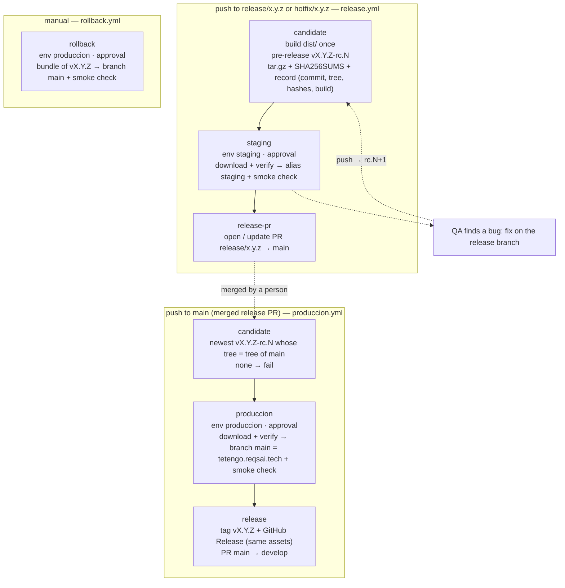

# Deploy: Cloudflare Pages, R2 and GitHub Actions

The landing and the Flutter PWA are **two Cloudflare Pages projects**, each on its own custom domain:

| Pages project      | Custom domain                     | Content                                 | Deployed by                                                                                                                         |
| ------------------ | --------------------------------- | --------------------------------------- | ----------------------------------------------------------------------------------------------------------------------------------- |
| `te-tengo-landing` | `https://tetengo.reqsai.tech`     | This Astro site                         | `release.yml` (`release/*`, `hotfix/*`: alias `staging`) and `produccion.yml` (`main`: production branch `main`) of this repository |
| `te-tengo-app`     | `https://app.tetengo.reqsai.tech` | The Flutter PWA, at the root path (`/`) | The release pipeline of `te-tengo-mobile-flutter` (alias `staging`, then production branch `main`)                                  |

The older `te-tengo` project is Git-connected to the thesis repository and serves the prototypes; these workflows never touch it.

The PWA used to live under `/app/` of the landing. Old links keep working: `public/_redirects` sends `/app`, `/app/` and `/app/*` to `https://app.tetengo.reqsai.tech/:splat` with a `301`. Cloudflare Pages accepts an absolute URL with a splat as a redirect target (the [redirects docs](https://developers.cloudflare.com/pages/configuration/redirects/) show `/blog/* https://blog.my.domain/:splat`), and redirects run before static assets. The browser keeps the `#fragment` across the redirect, so e-mailed hash links such as `/app/#/nueva-contrasena?token=…` still open the right screen.

The binaries are too large for Pages (25 MiB per file; the Windows installer is about 105 MB), so they live in the public **Cloudflare R2 bucket** `te-tengo-descargas` (public base URL in the variable `DESCARGAS_BASE_URL`). The app repositories upload them from their own release pipelines (`npx wrangler@4.149.0 r2 object put --remote`, with their own `CLOUDFLARE_API_TOKEN` and `CLOUDFLARE_ACCOUNT_ID` secrets); the landing only links to the production keys:

| Production key (root)                                             | Staging key                          | What                                              | Uploaded by                  |
| ----------------------------------------------------------------- | ------------------------------------ | ------------------------------------------------- | ---------------------------- |
| `te-tengo.apk`, `te-tengo.apk.sha256`                             | `staging/te-tengo.apk`               | Android universal APK                             | `te-tengo-mobile-flutter`    |
| `te-tengo-captura-setup.exe`, `te-tengo-captura-setup.exe.sha256` | `staging/te-tengo-captura-setup.exe` | Te Tengo Captura installer for Windows            | `te-tengo-desktop-pywebview` |
| `te-tengo-captura.dmg`                                            | `staging/te-tengo-captura.dmg`       | Te Tengo Captura for macOS (beta, not signed yet) | `te-tengo-desktop-pywebview` |

An old `te-tengo-web.tar.gz` object in the bucket is unused and can be deleted by hand.

## Workflows

| Workflow         | Trigger                                                 | Approval (environment) | Needs                                                                                                                                  |
| ---------------- | ------------------------------------------------------- | ---------------------- | -------------------------------------------------------------------------------------------------------------------------------------- |
| `ci.yml`         | push to `main`, `develop`, `release/*`, `hotfix/*`; PRs | no                     | nothing                                                                                                                                |
| `release.yml`    | push to `release/*`, `hotfix/*`                         | `staging`              | `CLOUDFLARE_API_TOKEN`, `CLOUDFLARE_ACCOUNT_ID`; variables `ENABLE_STAGING`, `DESCARGAS_BASE_URL`, `SITE_URL` and `APP_URL` (optional) |
| `produccion.yml` | push to `main` (the merged release PR); manual on main  | `produccion`           | `CLOUDFLARE_API_TOKEN`, `CLOUDFLARE_ACCOUNT_ID`; variable `ENABLE_LANDING_PRODUCCION`                                                  |
| `rollback.yml`   | manual on main, input `version`                         | `produccion`           | the same as `produccion.yml`; the release `vX.Y.Z` must carry its bundle (releases made by `produccion.yml`; not `v0.3.0` or older)    |

Pull requests and pushes to `develop` only run `ci.yml`: there is no dev stage and no pull request preview. `deploy.yml` and `etiquetar.yml` were replaced by `release.yml` and `produccion.yml`.

Every step whose secret or variable is missing prints a `::notice` with what to set and is skipped, so the workflows stay green before the setup is done.

### Switches

Each stage has an on/off switch: an **organization-level Actions variable** (_Organization settings → Secrets and variables → Actions → Variables_), visible to this repository. A repository variable with the same name overrides it. Only the exact value `true` turns a stage on; an unset variable or any other value turns it off, and the run shows the job as **skipped** (with a `::notice` and a line in the run summary). A switched-off stage never asks for an approval.

| Variable                    | Job                                              | What it deploys                                                                    |
| --------------------------- | ------------------------------------------------ | ---------------------------------------------------------------------------------- |
| `ENABLE_STAGING`            | `staging` of `release.yml`                       | The `staging` alias (`https://staging.te-tengo-landing.pages.dev`)                 |
| `ENABLE_LANDING_PRODUCCION` | `produccion` of `produccion.yml`, `rollback.yml` | The production branch `main` of `te-tengo-landing` = `https://tetengo.reqsai.tech` |

```bash
gh variable set ENABLE_STAGING --org Te-Tengo-Tech --visibility all --body true   # needs an org owner
gh variable set ENABLE_STAGING --body false                                       # override in this repository only
```

- `ENABLE_STAGING` off: the candidate is still built and stored, and the pull request to `main` opens right after it (its description says staging was skipped). Useful for an urgent hotfix; production still needs its approval.
- `ENABLE_LANDING_PRODUCCION` off (or no Cloudflare secrets): the merged release reaches `main` but nothing is deployed, so **no tag `vX.Y.Z` and no back-merge** are created. Turn it on and run _Produccion_ on `main` again (_Actions → Produccion → Run workflow_, or _Re-run all jobs_): it finds the same candidate and deploys it.

The other organization switches (`ENABLE_PWA`, `ENABLE_APK`, `ENABLE_WINDOWS_INSTALLER`, `ENABLE_MAC_DMG`, …) belong to the app repositories.

## Release flow: model C, tag at the end

The team's release strategy, "model C + tag at the end": [Gitflow](https://nvie.com/posts/a-successful-git-branching-model/) with a [SemVer](https://semver.org/) release candidate **built once**: staging is fed from the release branch, production from `main`, and both get **the same bytes**. The tag `vX.Y.Z` is created last, only when that version is live.



| Event                             | Jobs                                   | Environment (approval)                 | Result                                                                                       |
| --------------------------------- | -------------------------------------- | -------------------------------------- | -------------------------------------------------------------------------------------------- |
| push to `release/*` or `hotfix/*` | `candidate` → `staging` → `release-pr` | `staging` (jhosepmyr or elmer-riva)    | pre-release `vX.Y.Z-rc.N`, `https://staging.te-tengo-landing.pages.dev`, PR `release: x.y.z` |
| push to `main`                    | `candidate` → `produccion` → `release` | `produccion` (jhosepmyr or elmer-riva) | `https://tetengo.reqsai.tech`, then tag `vX.Y.Z` + GitHub Release, then PR `main → develop`  |
| Rollback (manual, on `main`)      | `resolve` → `rollback`                 | `produccion`                           | `https://tetengo.reqsai.tech` serves the bundle of an earlier `vX.Y.Z`                       |
| push to `develop`, pull request   | `ci.yml` only                          | none                                   | nothing deploys                                                                              |

### The candidate (release.yml)

- **Version.** `package.json` `version` is the version. The branch must be `release/<version>` or `hotfix/<version>` and `vX.Y.Z` must not exist yet; otherwise the candidate job fails and says what to fix. Bump `package.json` and add the `## [x.y.z]` section to `CHANGELOG.md` on the release branch.
- **Built once.** `pnpm build`, then `dist/version.json` (`version`, `build`, `commit`; the build number is `<run number>.<attempt>`, so it grows with every candidate). The bundle carries the final version: "rc" only exists in the name of the pre-release.
- **Stored durably.** Actions artifacts expire, so the bundle `te-tengo-landing-X.Y.Z.tar.gz` and `SHA256SUMS` are the assets of a GitHub **pre-release** `vX.Y.Z-rc.N` on the release commit (`N` = 1 + the highest existing `vX.Y.Z-rc.*`). Its notes hold a _candidate record_: version, candidate, build, commit, git tree (`git rev-parse HEAD^{tree}`), archive name, archive SHA-256, `dist/` fingerprint (one SHA-256 over every path and content) and the run. Candidates are never edited or deleted; a rejected one simply stays a pre-release. `rc` tags only live on release branches' commits; `vX.Y.Z` is never created here.
- **Staging.** `staging` (environment `staging`) runs [`.github/actions/pages-deploy`](../.github/actions/pages-deploy/action.yml): it downloads the bundle from the pre-release, checks its SHA-256 against the record and against the digest GitHub computed on upload, unpacks it, checks the `dist/` fingerprint and deploys it with `wrangler pages deploy --branch=staging`. Then `scripts/smoke-check.sh`: `200`, the canonical link to `https://tetengo.reqsai.tech/` (or `SITE_URL`) and the served `index.html` byte for byte the bundle's.
- **The release pull request.** `release-pr` opens `release/x.y.z → main` titled `release: x.y.z` with `GITHUB_TOKEN`, listing the candidate, its hashes and the staging URL. A new push to the branch builds `rc.N+1`, and the pull request description is replaced (plus a comment) once that candidate passes staging. A rejected staging approval or a failed smoke check opens nothing. A pull request opened with `GITHUB_TOKEN` starts no `pull_request` workflows, so its required check `Lint, types and build` comes from the `ci.yml` run of the push to the release branch, on the same commit.

### Production and the tag (produccion.yml)

- **Identity.** On the push to `main`, `candidate` looks for the newest `vX.Y.Z-rc.N` (X.Y.Z from `package.json` on `main`) whose recorded tree equals `git rev-parse HEAD^{tree}` of `main`, and checks that the rc tag points at a commit with that same tree. Any merge method (merge commit, squash, rebase) keeps the tree when `main` has nothing the release branch lacks. If no candidate matches, the run fails with "main differs from every tested candidate": merge `main` into the release branch (or push the missing change there), which builds and tests a new rc, then merge again.
- **Same bytes.** `produccion` (environment `produccion`) runs the same `pages-deploy` action with the candidate's tag, so production gets the exact file staging got (SHA-256, GitHub digest and fingerprint checked again), deployed with `--branch=main` under the `main` commit's hash and subject. Smoke check of `https://tetengo.reqsai.tech`.
- **Tag at the end.** Only when `produccion` deployed, `release` creates the GitHub Release `vX.Y.Z` on the `main` commit with the candidate's own assets (verified with `SHA256SUMS`), notes = the CHANGELOG section + the candidate and its record (read by `rollback.yml`). Then it opens `main → develop` (`chore: merge release x.y.z back into develop`) when `main` has commits `develop` lacks and no such pull request is open. If `produccion` failed, was rejected or skipped: no tag. _Re-run failed jobs_ deploys the same candidate; a re-run after a complete release sees the tag on the commit and does nothing.
- **Hotfix.** `hotfix/x.y.(z+1)` from `main` with the bumped `package.json`: the same pipeline (candidate → staging → PR to `main` → produccion → tag → back-merge). With `ENABLE_STAGING` off it goes straight to the pull request; production still asks for its approval.

### Rollback (rollback.yml)

_Actions → Rollback → Run workflow_ on `main`, `version` = an earlier final release (e.g. `0.4.0`). `resolve` reads the candidate record from the notes of `vX.Y.Z`; `rollback` (environment `produccion`, switch `ENABLE_LANDING_PRODUCCION`) deploys that release's bundle with the same checks and runs the smoke check. Nothing is rebuilt and no tag changes; fix forward with a hotfix. The landing has **no database**, so there is nothing to restore. Releases up to `v0.3.0` predate the candidate flow and carry no bundle: for those, use _Workers & Pages → te-tengo-landing → Deployments → Rollback_ in the Cloudflare dashboard.

### Environments, re-runs and queues

- **Environments.** `staging` accepts `release/*` and `hotfix/*`; `produccion` accepts `main`. Both have the required reviewers jhosepmyr and elmer-riva. The `dev` environment and `ENABLE_DEV` were deleted; the old `preview` environment is no longer used.
- **Concurrency.** Only one candidate is built at a time (group `release-candidate`), so two quick pushes never get the same `rc` number. No deploying job is ever cancelled: staging has a group per branch, and `produccion` and `rollback` share the group `landing-produccion` (`cancel-in-progress: false`). Before deploying, `pages-deploy` checks that the branch (`release/*` for staging, `main` for production) still points at the run's commit; if a newer push superseded it, the job deploys nothing, also after an approval, and the next steps are skipped.
- **Pull requests deploy nothing.** Review a change in its pull request and locally (`pnpm build && npx wrangler pages dev dist`); the first deployed copy is the `staging` alias of its release branch.
- **What is live.** `https://tetengo.reqsai.tech/version.json` shows the version, build and commit of the bundle in production.

## One-time setup (owner)

### 1. Cloudflare account

1. Create or use a Cloudflare account (the free plan covers Pages and R2's free tier).
2. Copy the **Account ID**: dashboard → _Workers & Pages_ → right column, _Account ID_.

### 2. Enable R2 and create the bucket

1. Dashboard → **R2 Object Storage** → _Purchase R2 / Enable_. R2 asks for a payment method even on the free tier (10 GB storage and egress-free reads included).
2. _Create bucket_: name `te-tengo-descargas` (any name; it goes in `DESCARGAS_R2_BUCKET`), location _Automatic_.
3. **Public access**, one of:
   - **r2.dev subdomain** (quick, rate-limited, fine for the pilot): bucket → _Settings_ → _Public access_ → _R2.dev subdomain_ → _Allow_. Copy the URL, e.g. `https://pub-xxxxxxxx.r2.dev`.
   - **Custom domain** (recommended once a domain exists): bucket → _Settings_ → _Custom Domains_ → _Connect Domain_, e.g. `descargas.<domain>`. The domain must be on Cloudflare.

### 3. API token

Dashboard → _My Profile_ → _API Tokens_ → _Create Token_ → _Create Custom Token_:

| Field             | Value                                                                                     |
| ----------------- | ----------------------------------------------------------------------------------------- |
| Permissions       | _Account_ · **Cloudflare Pages** · _Edit_ and _Account_ · **Workers R2 Storage** · _Edit_ |
| Account resources | _Include_ · your account                                                                  |
| TTL               | optional; renew before it expires                                                         |

### 4. Pages projects and custom domains

Both projects already exist with production branch `main`; the `pages-deploy` action creates `te-tengo-landing` if it is missing (the mobile repository's pipeline handles `te-tengo-app`). To create one by hand:

```bash
npx wrangler@4.149.0 pages project create te-tengo-landing --production-branch main --force
npx wrangler@4.149.0 pages project create te-tengo-app --production-branch main --force
```

(`--force` makes recent Wrangler versions create a Pages project instead of delegating to Workers; it is only needed when creating.) Their default URLs are `https://te-tengo-landing.pages.dev` and `https://te-tengo-app.pages.dev`.

The zone `reqsai.tech` is at the registrar (Namify), not on Cloudflare, so each custom domain is a `CNAME` at Namify's DNS plus a _Custom domains_ entry in its Pages project:

| Pages project      | Custom domain             | DNS record at Namify                             |
| ------------------ | ------------------------- | ------------------------------------------------ |
| `te-tengo-landing` | `tetengo.reqsai.tech`     | `CNAME` `tetengo` → `te-tengo-landing.pages.dev` |
| `te-tengo-app`     | `app.tetengo.reqsai.tech` | `CNAME` `app.tetengo` → `te-tengo-app.pages.dev` |

For each project:

1. _Workers & Pages_ → the project → _Custom domains_ → _Set up a custom domain_ → the domain above → _Continue_. Pages shows the `CNAME` it expects.
2. At Namify's DNS: add the `CNAME` record of the table (host `tetengo` or `app.tetengo`, value `<project>.pages.dev`). Do step 1 first: a `CNAME` to `*.pages.dev` for a domain the project does not know yet answers with Cloudflare error 522.
3. Wait until Pages shows the domain as _Active_ (it validates the `CNAME` and issues the certificate).

`SITE_URL` defaults to `https://tetengo.reqsai.tech` and the landing's app links (`APP_URL` in `src/config/site.ts`) default to `https://app.tetengo.reqsai.tech/`; both can be overridden with repository variables (below). The API is already configured for the app origin: `TT_PWA_URL=https://app.tetengo.reqsai.tech/`, `TT_ENLACE_BASE=https://app.tetengo.reqsai.tech/#` and the origin in its CORS list.

### 5. GitHub secrets, variables and settings

_Settings → Secrets and variables → Actions_ of this repository:

| Name                    | Kind     | Value                                                                                                               |
| ----------------------- | -------- | ------------------------------------------------------------------------------------------------------------------- |
| `CLOUDFLARE_API_TOKEN`  | secret   | The token of step 3                                                                                                 |
| `CLOUDFLARE_ACCOUNT_ID` | secret   | The Account ID of step 1                                                                                            |
| `DESCARGAS_BASE_URL`    | variable | Public URL of the R2 bucket, without a trailing slash (organization variable)                                       |
| `SITE_URL`              | variable | Optional: the canonical origin of the landing (default `https://tetengo.reqsai.tech`)                               |
| `APP_URL`               | variable | Optional: the PWA URL the landing links to, passed as `PUBLIC_APP_URL` (default `https://app.tetengo.reqsai.tech/`) |

```bash
gh secret set CLOUDFLARE_API_TOKEN
gh secret set CLOUDFLARE_ACCOUNT_ID
```

The app repositories keep their own `CLOUDFLARE_API_TOKEN` and `CLOUDFLARE_ACCOUNT_ID` secrets for their R2 uploads and the PWA deployment. This repository no longer builds the apps, so its earlier app-building secrets and variables (`TT_REPOS_TOKEN`, the Android keystore, `GOOGLE_SERVICES_JSON`, `TT_API_URL`, `DESCARGAS_R2_BUCKET`, the Firebase web values) are not read by any workflow here.

`release-pr` (`release.yml`) and `release` (`produccion.yml`) open pull requests with `GITHUB_TOKEN`, which needs _Settings → Actions → General → Workflow permissions → Allow GitHub Actions to create and approve pull requests_ (repository or organization level). Without it, `gh pr create` fails with a permissions error and the pull request has to be opened by hand.

## Headers and caching

- `public/_headers` (landing): security headers with a hashed CSP, `immutable` cache for `/_astro/*`.
- `deploy/app/_headers` (PWA, a reference copy; the mobile repository's pipeline ships the PWA's headers): `nosniff`, `Referrer-Policy`, HSTS, `X-Frame-Options` and `Cache-Control: no-cache` for everything, `no-store` for Flutter's unused `flutter_service_worker.js`. No CSP, COOP or Permissions-Policy: Flutter and Firebase need their own policy. `deploy/app/robots.txt` keeps the app out of search engines.
- The PWA's only service worker, `firebase-messaging-sw.js`, is at the root of the app origin, so its scope is `/`; it caches network first and receives FCM web push. The Firebase web config and `TT_FCM_VAPID_KEY` are `--dart-define` values of the mobile repository's PWA build, passed to the worker in its registration URL by the app; nothing in this repository injects them.
- R2 objects are uploaded with `Cache-Control: no-cache`, so a new upload under the same key is served at once.
- The PWA uses hash URLs (`https://app.tetengo.reqsai.tech/#/inicio`), so the app project needs no `_redirects`.

## Local checks

```bash
pnpm build && npx wrangler pages dev dist      # serves dist/ with _headers and _redirects
```
