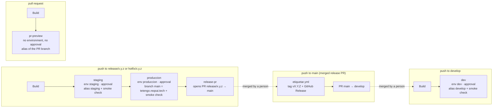

# Deploy: Cloudflare Pages, R2 and GitHub Actions

The landing and the Flutter PWA are **two Cloudflare Pages projects**, each on its own custom domain:

| Pages project      | Custom domain                     | Content                                 | Deployed by                                                                                        |
| ------------------ | --------------------------------- | --------------------------------------- | -------------------------------------------------------------------------------------------------- |
| `te-tengo-landing` | `https://tetengo.reqsai.tech`     | This Astro site                         | `deploy.yml` of this repository (`develop`, `release/*`, `hotfix/*`, pull request previews)        |
| `te-tengo-app`     | `https://app.tetengo.reqsai.tech` | The Flutter PWA, at the root path (`/`) | The release pipeline of `te-tengo-mobile-flutter` (alias `staging`, then production branch `main`) |

The older `te-tengo` project is Git-connected to the thesis repository and serves the prototypes; these workflows never touch it.

The PWA used to live under `/app/` of the landing. Old links keep working: `public/_redirects` sends `/app`, `/app/` and `/app/*` to `https://app.tetengo.reqsai.tech/:splat` with a `301`. Cloudflare Pages accepts an absolute URL with a splat as a redirect target (the [redirects docs](https://developers.cloudflare.com/pages/configuration/redirects/) show `/blog/* https://blog.my.domain/:splat`), and redirects run before static assets. The browser keeps the `#fragment` across the redirect, so e-mailed hash links such as `/app/#/nueva-contrasena?token=…` still open the right screen.

The binaries are too large for Pages (25 MiB per file; the Windows installer is about 105 MB), so they live in the public **Cloudflare R2 bucket** `te-tengo-descargas` (public base URL in the variable `DESCARGAS_BASE_URL`). The app repositories upload them from their own release pipelines (`npx wrangler@4.149.0 r2 object put --remote`, with their own `CLOUDFLARE_API_TOKEN` and `CLOUDFLARE_ACCOUNT_ID` secrets); the landing only links to the production keys:

| Production key (root)                                             | Staging key                          | What                                              | Uploaded by                  |
| ----------------------------------------------------------------- | ------------------------------------ | ------------------------------------------------- | ---------------------------- |
| `te-tengo.apk`, `te-tengo.apk.sha256`                             | `staging/te-tengo.apk`               | Android universal APK                             | `te-tengo-mobile-flutter`    |
| `te-tengo-captura-setup.exe`, `te-tengo-captura-setup.exe.sha256` | `staging/te-tengo-captura-setup.exe` | Te Tengo Captura installer for Windows            | `te-tengo-desktop-pywebview` |
| `te-tengo-captura.dmg`                                            | `staging/te-tengo-captura.dmg`       | Te Tengo Captura for macOS (beta, not signed yet) | `te-tengo-desktop-pywebview` |

An old `te-tengo-web.tar.gz` object in the bucket is unused and can be deleted by hand.

## Workflows

| Workflow        | Trigger                                                    | Approval (environment)                                                                  | Needs                                                                                                                                                                             |
| --------------- | ---------------------------------------------------------- | --------------------------------------------------------------------------------------- | --------------------------------------------------------------------------------------------------------------------------------------------------------------------------------- |
| `ci.yml`        | push to `main`, `develop`, `release/*`, `hotfix/*`; PRs    | no                                                                                      | nothing                                                                                                                                                                           |
| `deploy.yml`    | push to `develop`, `release/*`, `hotfix/*`; PRs (previews) | `dev` (develop), `staging` and `produccion` (release/hotfix); PR previews deploy freely | `CLOUDFLARE_API_TOKEN`, `CLOUDFLARE_ACCOUNT_ID`; variables `ENABLE_DEV`, `ENABLE_STAGING`, `ENABLE_LANDING_PRODUCCION`, `DESCARGAS_BASE_URL`, `SITE_URL` and `APP_URL` (optional) |
| `etiquetar.yml` | push to `main`                                             | no (deploys nothing)                                                                    | `GITHUB_TOKEN` only                                                                                                                                                               |

Every step whose secret or variable is missing prints a `::notice` with what to set and is skipped, so the workflows stay green before the setup is done.

### Switches

Each stage has an on/off switch: an **organization-level Actions variable** (_Organization settings → Secrets and variables → Actions → Variables_), visible to this repository. A repository variable with the same name overrides it. Only the exact value `true` turns a stage on; an unset variable or any other value turns it off, and the run shows the job as **skipped** (with a `::notice` and a line in the run summary of the `Build` job). A switched-off stage never asks for an approval. The build still runs, so every push keeps checking that the site builds and keeps its artifact.

| Variable                    | Job of `deploy.yml` | What it deploys                                                                    |
| --------------------------- | ------------------- | ---------------------------------------------------------------------------------- |
| `ENABLE_DEV`                | `dev`, `pr-preview` | The `develop` alias and the pull request aliases of `te-tengo-landing`             |
| `ENABLE_STAGING`            | `staging`           | The `staging` alias (`https://staging.te-tengo-landing.pages.dev`)                 |
| `ENABLE_LANDING_PRODUCCION` | `produccion`        | The production branch `main` of `te-tengo-landing` = `https://tetengo.reqsai.tech` |

```bash
gh variable set ENABLE_STAGING --org Te-Tengo-Tech --visibility all --body true   # needs an org owner
gh variable set ENABLE_STAGING --body false                                       # override in this repository only
```

With `ENABLE_STAGING` off, a release branch skips staging and `produccion` only needs the build; with it on, `produccion` only runs after `staging` deployed and passed its smoke check. The other organization switches (`ENABLE_PWA`, `ENABLE_APK`, `ENABLE_WINDOWS_INSTALLER`, `ENABLE_MAC_DMG`, …) belong to the app repositories.

## Release flow: build once, deploy many

`deploy.yml` builds the landing **once** per run (`Build`, which uploads `dist/` as the `landing-dist` artifact with a fingerprint of every file) and promotes that same artifact through the stages. No deploy job builds: each one runs [`.github/actions/pages-deploy`](../.github/actions/pages-deploy/action.yml), which downloads `landing-dist`, checks the fingerprint against the build job's and deploys it with `wrangler pages deploy`. The approvals are not written in the workflow; they are the required reviewers of the **environments** the jobs name.



| Event                             | Jobs                                                                                     | Environment (approval)                                                    | URL                                                                                                     |
| --------------------------------- | ---------------------------------------------------------------------------------------- | ------------------------------------------------------------------------- | ------------------------------------------------------------------------------------------------------- |
| push to `develop`                 | `Build` → `dev`                                                                          | `dev` (jhosepmyr or elmer-riva)                                           | `https://develop.te-tengo-landing.pages.dev`                                                            |
| push to `release/*` or `hotfix/*` | `Build` → `staging` → `produccion` → `release-pr`                                        | `staging`, then `produccion` (jhosepmyr or elmer-riva); `release-pr` none | `https://staging.te-tengo-landing.pages.dev`, then `https://tetengo.reqsai.tech`; then the PR to `main` |
| push to `main`                    | `etiquetar.yml` only (`deploy.yml` does not run)                                         | none                                                                      | tag `vX.Y.Z`, GitHub Release, PR `main → develop`                                                       |
| pull request from this repository | `Build` → `pr-preview`                                                                   | none                                                                      | `https://<branch>.te-tengo-landing.pages.dev` (`pr-<number>` for `main`/`develop`/`staging` heads)      |
| pull request from a fork          | `Build` only                                                                             | none                                                                      | none: forks get no secrets and `pr-preview` refuses them                                                |
| manual run                        | as a push to the branch it runs on; `main`: `Build` only; any other branch: `pr-preview` | as above                                                                  | as above                                                                                                |

- **Stages.** `develop` and `staging` are Pages _preview_ branches (aliases); the production branch of the project is `main`. `dev`, `staging` and `produccion` all end with `scripts/smoke-check.sh`: the URL must answer `200`, carry `<link rel="canonical" href="https://tetengo.reqsai.tech/">` (or `SITE_URL`) and be byte for byte the `index.html` of the artifact (Pages serves the uploaded HTML unchanged), with retries for about a minute. A failed staging smoke check stops the promotion; a failed production smoke check marks the run failed after the deployment (roll back under _Workers & Pages → te-tengo-landing → Deployments_ if needed).
- **Production from the release branch.** `produccion` deploys the release commit with `wrangler pages deploy --branch=main`, which is what publishes `https://tetengo.reqsai.tech`. The Pages deployment keeps the release commit's hash (`--commit-hash`) and subject (`--commit-message`, from the build job) and `--commit-dirty=false`, so the dashboard shows the release commit even though git's `main` only receives it later through the release pull request.
- **Same build, same commit.** `produccion` needs `staging` (or only the build when `ENABLE_STAGING` is off), downloads the same `landing-dist` and verifies the same fingerprint. The run summary lists the fingerprint and the alias it was promoted from.
- **The release pull request.** `release-pr` runs once production succeeded, or was skipped by its switch or by missing Cloudflare secrets, and nothing failed. It opens `release/x.y.z → main` (title `release: x.y.z`, from the branch name) with `GITHUB_TOKEN` and lists what was deployed where; if that pull request is already open, it adds a comment with the new run instead. Merging it is a human action (the `proteger-main` ruleset requires a review). A pull request opened with `GITHUB_TOKEN` starts no `pull_request` workflows, so its required check `Lint, types and build` comes from the `ci.yml` run of the push to the release branch, on the same commit.
- **Versions.** The build job warns when the branch name (`release/0.3.0`) and `package.json` (`0.3.0`) disagree, because `etiquetar.yml` tags `main` with the `package.json` version. Bump `package.json` and add the `## [x.y.z]` section to `CHANGELOG.md` on the release branch.
- **Tag and back-merge.** On the push to `main`, `etiquetar.yml` creates `vX.Y.Z` and a GitHub Release whose notes are the CHANGELOG section (skipped if the tag exists), then opens `main → develop` (title `chore: merge release x.y.z back into develop`) when `main` has commits that `develop` lacks and no such pull request is open. It deploys nothing.
- **Environments.** `dev` accepts `develop`; `staging` and `produccion` accept `release/*`, `hotfix/*` and `main`; all three have the required reviewers jhosepmyr and elmer-riva. A release run therefore asks twice: once for staging, once, after checking it, for production. The old `preview` environment is no longer used.
- **Pull requests stay without an environment.** A pull request preview must not wait for an approval, its deployments would mix with the history of the stages, and an environment adds no protection here: the Cloudflare secrets are repository secrets, which GitHub never gives to `pull_request` runs from forks, and `pr-preview` also checks that the head repository is this one. Anyone who can push a branch here can already deploy a preview alias, never production.
- **Re-runs and queues.** A new push to the same branch starts a new run. No deploying job is ever cancelled: each deploy job has its own concurrency group per branch and stage with `cancel-in-progress: false`, so a newer run's job waits while an older one deploys or waits for approval, and only the newest waiting job is kept. Before deploying, `pages-deploy` checks that the branch still points at the run's commit; if a newer push superseded it, the job deploys nothing (also after an approval), and `produccion` and `release-pr` are skipped for that run. Approving or rejecting a superseded run is therefore harmless.

## One-time setup (owner)

### 1. Cloudflare account

1. Create or use a Cloudflare account (the free plan covers Pages and R2's free tier).
2. Copy the **Account ID**: dashboard → _Workers & Pages_ → right column, _Account ID_.

### 2. Enable R2 and create the bucket

1. Dashboard → **R2 Object Storage** → _Purchase R2 / Enable_. R2 asks for a payment method even on the free tier (10 GB storage and egress-free reads included).
2. _Create bucket_: name `te-tengo-descargas` (any name; it goes in `DESCARGAS_R2_BUCKET`), location _Automatic_.
3. **Public access**, one of:
   - **r2.dev subdomain** (quick, rate-limited, fine for the pilot): bucket → _Settings_ → _Public access_ → _R2.dev subdomain_ → _Allow_. Copy the URL, e.g. `https://pub-xxxxxxxx.r2.dev`.
   - **Custom domain** (recommended once a domain exists): bucket → _Settings_ → _Custom Domains_ → _Connect Domain_, e.g. `descargas.<domain>`. The domain must be on Cloudflare.

### 3. API token

Dashboard → _My Profile_ → _API Tokens_ → _Create Token_ → _Create Custom Token_:

| Field             | Value                                                                                     |
| ----------------- | ----------------------------------------------------------------------------------------- |
| Permissions       | _Account_ · **Cloudflare Pages** · _Edit_ and _Account_ · **Workers R2 Storage** · _Edit_ |
| Account resources | _Include_ · your account                                                                  |
| TTL               | optional; renew before it expires                                                         |

### 4. Pages projects and custom domains

Both projects already exist with production branch `main`; `deploy.yml` creates `te-tengo-landing` if it is missing (the mobile repository's pipeline handles `te-tengo-app`). To create one by hand:

```bash
npx wrangler@4.149.0 pages project create te-tengo-landing --production-branch main --force
npx wrangler@4.149.0 pages project create te-tengo-app --production-branch main --force
```

(`--force` makes recent Wrangler versions create a Pages project instead of delegating to Workers; it is only needed when creating.) Their default URLs are `https://te-tengo-landing.pages.dev` and `https://te-tengo-app.pages.dev`.

The zone `reqsai.tech` is at the registrar (Namify), not on Cloudflare, so each custom domain is a `CNAME` at Namify's DNS plus a _Custom domains_ entry in its Pages project:

| Pages project      | Custom domain             | DNS record at Namify                             |
| ------------------ | ------------------------- | ------------------------------------------------ |
| `te-tengo-landing` | `tetengo.reqsai.tech`     | `CNAME` `tetengo` → `te-tengo-landing.pages.dev` |
| `te-tengo-app`     | `app.tetengo.reqsai.tech` | `CNAME` `app.tetengo` → `te-tengo-app.pages.dev` |

For each project:

1. _Workers & Pages_ → the project → _Custom domains_ → _Set up a custom domain_ → the domain above → _Continue_. Pages shows the `CNAME` it expects.
2. At Namify's DNS: add the `CNAME` record of the table (host `tetengo` or `app.tetengo`, value `<project>.pages.dev`). Do step 1 first: a `CNAME` to `*.pages.dev` for a domain the project does not know yet answers with Cloudflare error 522.
3. Wait until Pages shows the domain as _Active_ (it validates the `CNAME` and issues the certificate).

`SITE_URL` defaults to `https://tetengo.reqsai.tech` and the landing's app links (`APP_URL` in `src/config/site.ts`) default to `https://app.tetengo.reqsai.tech/`; both can be overridden with repository variables (below). The API is already configured for the app origin: `TT_PWA_URL=https://app.tetengo.reqsai.tech/`, `TT_ENLACE_BASE=https://app.tetengo.reqsai.tech/#` and the origin in its CORS list.

### 5. GitHub secrets, variables and settings

_Settings → Secrets and variables → Actions_ of this repository:

| Name                    | Kind     | Value                                                                                                               |
| ----------------------- | -------- | ------------------------------------------------------------------------------------------------------------------- |
| `CLOUDFLARE_API_TOKEN`  | secret   | The token of step 3                                                                                                 |
| `CLOUDFLARE_ACCOUNT_ID` | secret   | The Account ID of step 1                                                                                            |
| `DESCARGAS_BASE_URL`    | variable | Public URL of the R2 bucket, without a trailing slash (organization variable)                                       |
| `SITE_URL`              | variable | Optional: the canonical origin of the landing (default `https://tetengo.reqsai.tech`)                               |
| `APP_URL`               | variable | Optional: the PWA URL the landing links to, passed as `PUBLIC_APP_URL` (default `https://app.tetengo.reqsai.tech/`) |

```bash
gh secret set CLOUDFLARE_API_TOKEN
gh secret set CLOUDFLARE_ACCOUNT_ID
```

The app repositories keep their own `CLOUDFLARE_API_TOKEN` and `CLOUDFLARE_ACCOUNT_ID` secrets for their R2 uploads and the PWA deployment. This repository no longer builds the apps, so its earlier app-building secrets and variables (`TT_REPOS_TOKEN`, the Android keystore, `GOOGLE_SERVICES_JSON`, `TT_API_URL`, `DESCARGAS_R2_BUCKET`, the Firebase web values) are not read by any workflow here.

`release-pr` and `etiquetar.yml` open pull requests with `GITHUB_TOKEN`, which needs _Settings → Actions → General → Workflow permissions → Allow GitHub Actions to create and approve pull requests_ (repository or organization level). Without it, `gh pr create` fails with a permissions error and the pull request has to be opened by hand.

## Headers and caching

- `public/_headers` (landing): security headers with a hashed CSP, `immutable` cache for `/_astro/*`.
- `deploy/app/_headers` (PWA, a reference copy; the mobile repository's pipeline ships the PWA's headers): `nosniff`, `Referrer-Policy`, HSTS, `X-Frame-Options` and `Cache-Control: no-cache` for everything, `no-store` for Flutter's unused `flutter_service_worker.js`. No CSP, COOP or Permissions-Policy: Flutter and Firebase need their own policy. `deploy/app/robots.txt` keeps the app out of search engines.
- The PWA's only service worker, `firebase-messaging-sw.js`, is at the root of the app origin, so its scope is `/`; it caches network first and receives FCM web push. The Firebase web config and `TT_FCM_VAPID_KEY` are `--dart-define` values of the mobile repository's PWA build, passed to the worker in its registration URL by the app; nothing in this repository injects them.
- R2 objects are uploaded with `Cache-Control: no-cache`, so a new upload under the same key is served at once.
- The PWA uses hash URLs (`https://app.tetengo.reqsai.tech/#/inicio`), so the app project needs no `_redirects`.

## Local checks

```bash
pnpm build && npx wrangler pages dev dist      # serves dist/ with _headers and _redirects
```
