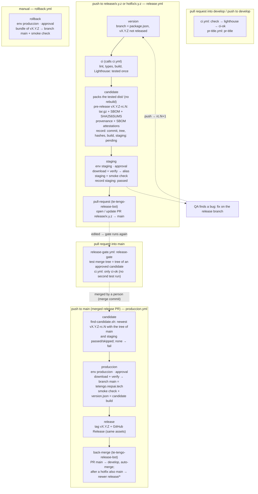

# Deploy: Cloudflare Pages, R2 and GitHub Actions

The landing and the Flutter PWA are **two Cloudflare Pages projects**, each on its own custom domain:

| Pages project      | Custom domain                     | Content                                 | Deployed by                                                                                                                         |
| ------------------ | --------------------------------- | --------------------------------------- | ----------------------------------------------------------------------------------------------------------------------------------- |
| `te-tengo-landing` | `https://tetengo.reqsai.tech`     | This Astro site                         | `release.yml` (`release/*`, `hotfix/*`: alias `staging`) and `produccion.yml` (`main`: production branch `main`) of this repository |
| `te-tengo-app`     | `https://app.tetengo.reqsai.tech` | The Flutter PWA, at the root path (`/`) | The release pipeline of `te-tengo-mobile-flutter` (alias `staging`, then production branch `main`)                                  |

The older `te-tengo` project is Git-connected to the thesis repository and serves the prototypes; these workflows never touch it.

The PWA used to live under `/app/` of the landing. Old links keep working: `public/_redirects` sends `/app`, `/app/` and `/app/*` to `https://app.tetengo.reqsai.tech/:splat` with a `301`. Cloudflare Pages accepts an absolute URL with a splat as a redirect target (the [redirects docs](https://developers.cloudflare.com/pages/configuration/redirects/) show `/blog/* https://blog.my.domain/:splat`), and redirects run before static assets. The browser keeps the `#fragment` across the redirect, so e-mailed hash links such as `/app/#/nueva-contrasena?token=…` still open the right screen.

The binaries are too large for Pages (25 MiB per file; the Windows installer is about 105 MB), so they live in the public **Cloudflare R2 bucket** `te-tengo-descargas` (public base URL in the variable `DESCARGAS_BASE_URL`). The app repositories upload them from their own release pipelines (`npx wrangler@4.149.0 r2 object put --remote`, with their own `CLOUDFLARE_API_TOKEN` and `CLOUDFLARE_ACCOUNT_ID` secrets); the landing only links to the production keys:

| Production key (root)                                             | Staging key                          | What                                              | Uploaded by                  |
| ----------------------------------------------------------------- | ------------------------------------ | ------------------------------------------------- | ---------------------------- |
| `te-tengo.apk`, `te-tengo.apk.sha256`                             | `staging/te-tengo.apk`               | Android universal APK                             | `te-tengo-mobile-flutter`    |
| `te-tengo-captura-setup.exe`, `te-tengo-captura-setup.exe.sha256` | `staging/te-tengo-captura-setup.exe` | Te Tengo Captura installer for Windows            | `te-tengo-desktop-pywebview` |
| `te-tengo-captura.dmg`                                            | `staging/te-tengo-captura.dmg`       | Te Tengo Captura for macOS (beta, not signed yet) | `te-tengo-desktop-pywebview` |

An old `te-tengo-web.tar.gz` object in the bucket is unused and can be deleted by hand.

## Workflows

| Workflow           | Trigger                                                   | Approval (environment) | Needs                                                                                                                                                                                                            |
| ------------------ | --------------------------------------------------------- | ---------------------- | ---------------------------------------------------------------------------------------------------------------------------------------------------------------------------------------------------------------- |
| `ci.yml`           | pull requests; push to `develop`; called by `release.yml` | no                     | nothing                                                                                                                                                                                                          |
| `pr-title.yml`     | pull requests (opened, edited, synchronize)               | no                     | nothing                                                                                                                                                                                                          |
| `release-gate.yml` | pull requests into `main` (opened, edited, synchronize)   | no                     | nothing (reads the candidates with `GITHUB_TOKEN`)                                                                                                                                                               |
| `release.yml`      | push to `release/*`, `hotfix/*`                           | `staging`              | `CLOUDFLARE_API_TOKEN`, `CLOUDFLARE_ACCOUNT_ID` of `staging`; `RELEASE_APP_ID` + `RELEASE_APP_PRIVATE_KEY` (organization); variables `ENABLE_STAGING`, `DESCARGAS_BASE_URL`, `SITE_URL` and `APP_URL` (optional) |
| `produccion.yml`   | push to `main` (the merged release PR); manual on main    | `produccion`           | `CLOUDFLARE_API_TOKEN`, `CLOUDFLARE_ACCOUNT_ID` of `produccion`; `RELEASE_APP_ID` + `RELEASE_APP_PRIVATE_KEY`; variable `ENABLE_LANDING_PRODUCCION`                                                              |
| `rollback.yml`     | manual on main, input `version`                           | `produccion`           | the same as `produccion.yml`; the release `vX.Y.Z` must carry its bundle (releases made by `produccion.yml`; not `v0.3.0` or older)                                                                              |

Pull requests and pushes to `develop` only run checks (`ci.yml`, `pr-title.yml`): there is no dev stage and no pull request preview.

**Required checks** (rulesets): `develop` requires `ci-ok` and `pr-title`; `main` requires `ci-ok`, `release-gate` and `pr-title`. `ci-ok` is the last job of `ci.yml`; it always runs and fails unless every CI job passed, so it is the one stable name the rulesets need, whatever jobs CI grows.

**The release bot.** Every pull request a workflow opens (`release: x.y.z` into `main`, the back-merge into `develop`) is opened by the GitHub App **te-tengo-release-bot** (`actions/create-github-app-token`, organization variable `RELEASE_APP_ID` and secret `RELEASE_APP_PRIVATE_KEY`), never with `GITHUB_TOKEN`: a pull request opened with `GITHUB_TOKEN` starts no `pull_request` workflow, so its required checks would never run, and since June 2026 GitHub also leaves phantom "action required" runs on it. Without the App the job fails with an error that says so; nothing falls back to `GITHUB_TOKEN`.

A missing Cloudflare secret fails the deploy job that needs it (`staging`, `produccion`, `rollback`), with an error naming it; switched-off stages are skipped with a notice.

### Switches

Each stage has an on/off switch: an **organization-level Actions variable** (_Organization settings → Secrets and variables → Actions → Variables_), visible to this repository. A repository variable with the same name overrides it. Only the exact value `true` turns a stage on; an unset variable or any other value turns it off, and the run shows the job as **skipped** (with a `::notice` and a line in the run summary). A switched-off stage never asks for an approval.

| Variable                    | Job                                              | What it deploys                                                                    |
| --------------------------- | ------------------------------------------------ | ---------------------------------------------------------------------------------- |
| `ENABLE_STAGING`            | `staging` of `release.yml`                       | The `staging` alias (`https://staging.te-tengo-landing.pages.dev`)                 |
| `ENABLE_LANDING_PRODUCCION` | `produccion` of `produccion.yml`, `rollback.yml` | The production branch `main` of `te-tengo-landing` = `https://tetengo.reqsai.tech` |

```bash
gh variable set ENABLE_STAGING --org Te-Tengo-Tech --visibility all --body true   # needs an org owner
gh variable set ENABLE_STAGING --body false                                       # override in this repository only
```

- `ENABLE_STAGING` off: the candidate is still built and stored, recorded `staging: skipped`, and the pull request to `main` opens right after it (its description says staging was skipped). Useful for an urgent hotfix; production still needs its approval.
- `ENABLE_LANDING_PRODUCCION` off: the merged release reaches `main` but nothing is deployed, so **no tag `vX.Y.Z` and no back-merge** are created. Turn it on and run _Produccion_ on `main` again (_Actions → Produccion → Run workflow_, or _Re-run all jobs_): it finds the same candidate and deploys it.

The other organization switches (`ENABLE_PWA`, `ENABLE_APK`, `ENABLE_WINDOWS_INSTALLER`, `ENABLE_MAC_DMG`, …) belong to the app repositories.

## Release flow: model C, tag at the end

The team's release strategy, "model C + tag at the end": [Gitflow](https://nvie.com/posts/a-successful-git-branching-model/) with a [SemVer](https://semver.org/) release candidate **built once**: staging is fed from the release branch, production from `main`, and both get **the same bytes**. The tag `vX.Y.Z` is created last, only when that version is live.



| Event                                          | Jobs                                                         | Environment (approval)                 | Result                                                                                       |
| ---------------------------------------------- | ------------------------------------------------------------ | -------------------------------------- | -------------------------------------------------------------------------------------------- |
| pull request into `develop`, push to `develop` | `ci.yml`: `check` → `lighthouse` → `ci-ok`; `pr-title` (PRs) | none                                   | checks only, nothing deploys                                                                 |
| push to `release/*` or `hotfix/*`              | `version` → `ci` → `candidate` → `staging` → `pull-request`  | `staging` (jhosepmyr or elmer-riva)    | pre-release `vX.Y.Z-rc.N`, `https://staging.te-tengo-landing.pages.dev`, PR `release: x.y.z` |
| pull request into `main`                       | `release-gate`; `ci.yml`: only `ci-ok`; `pr-title`           | none                                   | mergeable once the candidate of the head passed staging                                      |
| push to `main`                                 | `candidate` → `produccion` → `release` → `back-merge`        | `produccion` (jhosepmyr or elmer-riva) | `https://tetengo.reqsai.tech`, then tag `vX.Y.Z` + GitHub Release, then PR `main → develop`  |
| Rollback (manual, on `main`)                   | `resolve` → `rollback`                                       | `produccion`                           | `https://tetengo.reqsai.tech` serves the bundle of an earlier `vX.Y.Z`                       |

### The candidate (release.yml)

- **Version.** `package.json` `version` is the version. The branch must be `release/<version>` or `hotfix/<version>` and `vX.Y.Z` must not exist yet; otherwise the `version` job fails and says what to fix. Bump `package.json` and add the `## [x.y.z]` section to `CHANGELOG.md` on the release branch.
- **Tested once.** The `ci` job calls `ci.yml` on the release commit (lint, `astro check`, build, Lighthouse). This is the only test run of the release: the pull request into `main` does not test it again (its `ci-ok` only checks that it comes from a release branch) and nothing is tested on `main`; `release-gate` proves that `main` gets exactly this tested tree.
- **Built once.** `candidate` takes the `dist/` that `ci` built and Lighthouse checked in the same run (no second build), adds `dist/version.json` (`version`, `build`, `commit`; the build number is `<run number>.<attempt>`, so it grows with every candidate) and packs it. The bundle carries the final version: "rc" only exists in the name of the pre-release.
- **Stored durably.** Actions artifacts expire, so the bundle `te-tengo-landing-X.Y.Z.tar.gz`, its SBOM `te-tengo-landing-X.Y.Z.spdx.json` (SPDX, from `pnpm-lock.yaml`) and `SHA256SUMS` are the assets of a GitHub **pre-release** `vX.Y.Z-rc.N` on the release commit (`N` = 1 + the highest existing `vX.Y.Z-rc.*`). Its notes hold a _candidate record_: version, candidate, build, commit, git tree (`git rev-parse HEAD^{tree}`), archive name, archive SHA-256, `dist/` fingerprint (one SHA-256 over every path and content), `staging` (`pending`, `passed`, or `skipped` when `ENABLE_STAGING` was off) and the run. Candidates are never deleted and only their `staging` line ever changes; a rejected one simply stays `pending`. `rc` tags only live on release branches' commits; `vX.Y.Z` is never created here.
- **Attestations.** The bundle gets a build provenance attestation and an SBOM attestation (Sigstore, stored by GitHub). Anyone can check a downloaded bundle: `gh attestation verify te-tengo-landing-X.Y.Z.tar.gz --repo Te-Tengo-Tech/te-tengo-landing-astro`. Production deploys the same bytes, so the attestations hold for the final release too.
- **Staging.** `staging` (environment `staging`) runs [`.github/actions/pages-deploy`](../.github/actions/pages-deploy/action.yml): it checks the Cloudflare secrets of the environment, downloads the bundle from the pre-release, checks its SHA-256 against the record and against the digest GitHub computed on upload, unpacks it, checks the `dist/` fingerprint and deploys it with `wrangler pages deploy --branch=staging`. Then `scripts/smoke-check.sh`: `200`, the canonical link to `https://tetengo.reqsai.tech/` (or `SITE_URL`) and the served `index.html` byte for byte the bundle's. Only then is `staging: passed` written into the candidate record.
- **The release pull request.** `pull-request` opens `release/x.y.z → main` titled `release: x.y.z` as **te-tengo-release-bot**, listing the candidate, its hashes, the staging URL and the run. A new push to the branch builds `rc.N+1`, and the pull request description is replaced (plus a comment) once that candidate passes staging. A rejected staging approval or a failed smoke check opens nothing. Because the App opens it, its checks run like any pull request's.

### The release gate (release-gate.yml)

The required check `release-gate` of every pull request into `main` ([`.github/scripts/release-gate.sh`](../.github/scripts/release-gate.sh), the same script in every Te Tengo repository) passes only when:

1. the head is `release/x.y.z` or `hotfix/x.y.z` of this repository, `package.json` at the head says `x.y.z`, and `vX.Y.Z` does not exist;
2. GitHub's test merge of the pull request has the same git tree as the head, i.e. `main` has nothing the branch lacks (otherwise: merge `main` into the branch, which builds a new candidate);
3. [`.github/scripts/find-candidate.sh`](../.github/scripts/find-candidate.sh) finds a candidate of `x.y.z` with that tree and `staging: passed` (or `skipped`). `produccion.yml` uses the same script after the merge, so a green gate means production finds its candidate.

A push to the release branch makes the gate fail until the candidate of that commit has passed staging; the `pull-request` job then edits the pull request, and that `edited` event runs the gate again. Merge with a **merge commit**.

### Production and the tag (produccion.yml)

- **Identity.** On the push to `main`, `candidate` runs `find-candidate.sh` with the version of `package.json` and `git rev-parse HEAD^{tree}` of `main`: the newest `vX.Y.Z-rc.N` whose recorded tree equals it, whose rc tag points at a commit with that same tree and whose staging passed (or was switched off). If none matches, the run fails with "main is not the tree of any candidate that passed staging": merge `main` into the release branch (or push the missing change there), which builds and tests a new rc, then merge again. No CI runs on `main`: the release was tested on its branch.
- **Same bytes.** `produccion` (environment `produccion`) runs the same `pages-deploy` action with the candidate's tag, so production gets the exact file staging got (SHA-256, GitHub digest and fingerprint checked again), deployed with `--branch=main` under the `main` commit's hash and subject. Post-deploy check: the smoke check of `https://tetengo.reqsai.tech` plus `version.json`, which must name the candidate's version and build (proof that the new bundle is the one served).
- **Tag at the end.** Only when `produccion` deployed, `release` creates the GitHub Release `vX.Y.Z` on the `main` commit with the candidate's own assets (bundle, SBOM, `SHA256SUMS`, verified again), notes = the CHANGELOG section + the candidate and its record (read by `rollback.yml`). If `produccion` failed, was rejected, superseded or switched off: no tag. _Re-run failed jobs_ deploys the same candidate; a re-run after a complete release sees the tag on the commit and does nothing.
- **Back-merge.** `back-merge` ([`.github/scripts/back-merge.sh`](../.github/scripts/back-merge.sh)) opens `main → develop` (`chore: merge release x.y.z back into develop`) as te-tengo-release-bot and turns on **auto-merge with a merge commit**: it merges itself once approved and green (if the repository does not allow auto-merge, it stays open with a warning). After a hotfix, it also opens `main → release/a.b.c` for every open release branch with a newer version that lacks the fix (no auto-merge: that merge builds a new candidate).
- **Hotfix.** `hotfix/x.y.(z+1)` from `main` with the bumped `package.json`: the same pipeline (candidate → staging → PR to `main` → release gate → produccion → tag → back-merge). With `ENABLE_STAGING` off it goes straight to the pull request; production still asks for its approval.

### Rollback (rollback.yml)

_Actions → Rollback → Run workflow_ on `main`, `version` = an earlier final release (e.g. `0.4.0`). `resolve` reads the candidate record from the notes of `vX.Y.Z`; `rollback` (environment `produccion`, switch `ENABLE_LANDING_PRODUCCION`) deploys that release's bundle with the same checks and runs the smoke check and the `version.json` check. Nothing is rebuilt and no tag changes; fix forward with a hotfix. The landing has **no database**, so there is nothing to restore. Releases up to `v0.3.0` predate the candidate flow and carry no bundle: for those, use _Workers & Pages → te-tengo-landing → Deployments → Rollback_ in the Cloudflare dashboard.

**Rehearsal.** The rollback has never run in production. Rehearse it once, and again after any change to `rollback.yml` or `pages-deploy`: run _Rollback_ with the version that is live right now (today `0.4.0`). It redeploys the same bytes, so visitors see no change, but it exercises the whole path: the approval, the download and its three checks, the deploy and the post-deploy checks. Then check `https://tetengo.reqsai.tech/version.json` and write the date, the run URL and the result in the team's operations log. After the next release, rehearse a real step back (the previous version) and forward again (_Rollback_ with the new version).

### Environments, re-runs and queues

- **Environments.** `staging` accepts `release/*` and `hotfix/*`; `produccion` accepts `main`. Both have the required reviewers jhosepmyr and elmer-riva. The `dev` environment and `ENABLE_DEV` were deleted; the old `preview` environment is no longer used.
- **Concurrency.** Only one candidate is built at a time (group `release-candidate`), so two quick pushes never get the same `rc` number. No deploying job is ever cancelled: staging has a group per branch, and `produccion` and `rollback` share the group `landing-produccion` (`cancel-in-progress: false`). `ci.yml`, when `release.yml` calls it, uses its own group (`ci-Release-push-<ref>`), never the caller's, so a call can never wait for its own run. Before deploying, `pages-deploy` checks that the branch (`release/*` for staging, `main` for production) still points at the run's commit; if a newer push superseded it, the job deploys nothing, also after an approval, and the next steps are skipped.
- **Pull requests deploy nothing.** Review a change in its pull request and locally (`pnpm build && npx wrangler pages dev dist`); the first deployed copy is the `staging` alias of its release branch.
- **What is live.** `https://tetengo.reqsai.tech/version.json` shows the version, build and commit of the bundle in production.

## One-time setup (owner)

### 1. Cloudflare account

1. Create or use a Cloudflare account (the free plan covers Pages and R2's free tier).
2. Copy the **Account ID**: dashboard → _Workers & Pages_ → right column, _Account ID_.

### 2. Enable R2 and create the bucket

1. Dashboard → **R2 Object Storage** → _Purchase R2 / Enable_. R2 asks for a payment method even on the free tier (10 GB storage and egress-free reads included).
2. _Create bucket_: name `te-tengo-descargas` (any name; it goes in `DESCARGAS_R2_BUCKET`), location _Automatic_.
3. **Public access**, one of:
   - **r2.dev subdomain** (quick, rate-limited, fine for the pilot): bucket → _Settings_ → _Public access_ → _R2.dev subdomain_ → _Allow_. Copy the URL, e.g. `https://pub-xxxxxxxx.r2.dev`.
   - **Custom domain** (recommended once a domain exists): bucket → _Settings_ → _Custom Domains_ → _Connect Domain_, e.g. `descargas.<domain>`. The domain must be on Cloudflare.

### 3. API token

Dashboard → _My Profile_ → _API Tokens_ → _Create Token_ → _Create Custom Token_:

| Field             | Value                                                                                     |
| ----------------- | ----------------------------------------------------------------------------------------- |
| Permissions       | _Account_ · **Cloudflare Pages** · _Edit_ and _Account_ · **Workers R2 Storage** · _Edit_ |
| Account resources | _Include_ · your account                                                                  |
| TTL               | optional; renew before it expires                                                         |

### 4. Pages projects and custom domains

Both projects already exist with production branch `main`; the `pages-deploy` action creates `te-tengo-landing` if it is missing (the mobile repository's pipeline handles `te-tengo-app`). To create one by hand:

```bash
npx wrangler@4.149.0 pages project create te-tengo-landing --production-branch main --force
npx wrangler@4.149.0 pages project create te-tengo-app --production-branch main --force
```

(`--force` makes recent Wrangler versions create a Pages project instead of delegating to Workers; it is only needed when creating.) Their default URLs are `https://te-tengo-landing.pages.dev` and `https://te-tengo-app.pages.dev`.

The zone `reqsai.tech` is at the registrar (Namify), not on Cloudflare, so each custom domain is a `CNAME` at Namify's DNS plus a _Custom domains_ entry in its Pages project:

| Pages project      | Custom domain             | DNS record at Namify                             |
| ------------------ | ------------------------- | ------------------------------------------------ |
| `te-tengo-landing` | `tetengo.reqsai.tech`     | `CNAME` `tetengo` → `te-tengo-landing.pages.dev` |
| `te-tengo-app`     | `app.tetengo.reqsai.tech` | `CNAME` `app.tetengo` → `te-tengo-app.pages.dev` |

For each project:

1. _Workers & Pages_ → the project → _Custom domains_ → _Set up a custom domain_ → the domain above → _Continue_. Pages shows the `CNAME` it expects.
2. At Namify's DNS: add the `CNAME` record of the table (host `tetengo` or `app.tetengo`, value `<project>.pages.dev`). Do step 1 first: a `CNAME` to `*.pages.dev` for a domain the project does not know yet answers with Cloudflare error 522.
3. Wait until Pages shows the domain as _Active_ (it validates the `CNAME` and issues the certificate).

`SITE_URL` defaults to `https://tetengo.reqsai.tech` and the landing's app links (`APP_URL` in `src/config/site.ts`) default to `https://app.tetengo.reqsai.tech/`; both can be overridden with repository variables (below). The API is already configured for the app origin: `TT_PWA_URL=https://app.tetengo.reqsai.tech/`, `TT_ENLACE_BASE=https://app.tetengo.reqsai.tech/#` and the origin in its CORS list.

### 5. GitHub secrets, variables and settings

The Cloudflare token deploys, so it lives in the **environments**, not in the repository: only a job that passed its environment's rules (branch policy and required reviewers) can read it. _Settings → Environments → staging_ and _→ produccion_, _Environment secrets_:

| Name                    | Kind               | Value                                                                                           |
| ----------------------- | ------------------ | ----------------------------------------------------------------------------------------------- |
| `CLOUDFLARE_API_TOKEN`  | environment secret | The token of step 3 (one token per environment is better: the staging one can be revoked alone) |
| `CLOUDFLARE_ACCOUNT_ID` | environment secret | The Account ID of step 1                                                                        |

```bash
gh secret set CLOUDFLARE_API_TOKEN --env staging
gh secret set CLOUDFLARE_ACCOUNT_ID --env staging
gh secret set CLOUDFLARE_API_TOKEN --env produccion
gh secret set CLOUDFLARE_ACCOUNT_ID --env produccion
gh secret delete CLOUDFLARE_API_TOKEN && gh secret delete CLOUDFLARE_ACCOUNT_ID   # the old repository copies
```

_Settings → Secrets and variables → Actions → Variables_:

| Name                 | Kind     | Value                                                                                                               |
| -------------------- | -------- | ------------------------------------------------------------------------------------------------------------------- |
| `DESCARGAS_BASE_URL` | variable | Public URL of the R2 bucket, without a trailing slash (organization variable)                                       |
| `SITE_URL`           | variable | Optional: the canonical origin of the landing (default `https://tetengo.reqsai.tech`)                               |
| `APP_URL`            | variable | Optional: the PWA URL the landing links to, passed as `PUBLIC_APP_URL` (default `https://app.tetengo.reqsai.tech/`) |

The organization variable `RELEASE_APP_ID` and secret `RELEASE_APP_PRIVATE_KEY` belong to the GitHub App te-tengo-release-bot (installed on every repository of the organization with Contents, Pull requests, Actions and Workflows: read and write). `GITHUB_TOKEN` no longer opens pull requests here, so _Allow GitHub Actions to create and approve pull requests_ is not needed.

The app repositories keep their own Cloudflare secrets for their R2 uploads and the PWA deployment. This repository no longer builds the apps: the copies of the Android keystore (`ANDROID_KEYSTORE_*`), `GOOGLE_SERVICES_JSON` and `TT_REPOS_TOKEN` it still holds are read by no workflow and should be deleted, and so should the variables `TT_API_URL`, `DESCARGAS_R2_BUCKET` and the Firebase web values.

## Headers and caching

- `public/_headers` (landing): security headers with a hashed CSP, `immutable` cache for `/_astro/*`.
- `deploy/app/_headers` (PWA, a reference copy; the mobile repository's pipeline ships the PWA's headers): `nosniff`, `Referrer-Policy`, HSTS, `X-Frame-Options` and `Cache-Control: no-cache` for everything, `no-store` for Flutter's unused `flutter_service_worker.js`. No CSP, COOP or Permissions-Policy: Flutter and Firebase need their own policy. `deploy/app/robots.txt` keeps the app out of search engines.
- The PWA's only service worker, `firebase-messaging-sw.js`, is at the root of the app origin, so its scope is `/`; it caches network first and receives FCM web push. The Firebase web config and `TT_FCM_VAPID_KEY` are `--dart-define` values of the mobile repository's PWA build, passed to the worker in its registration URL by the app; nothing in this repository injects them.
- R2 objects are uploaded with `Cache-Control: no-cache`, so a new upload under the same key is served at once.
- The PWA uses hash URLs (`https://app.tetengo.reqsai.tech/#/inicio`), so the app project needs no `_redirects`.

## Local checks

```bash
pnpm build && npx wrangler pages dev dist      # serves dist/ with _headers and _redirects
```
